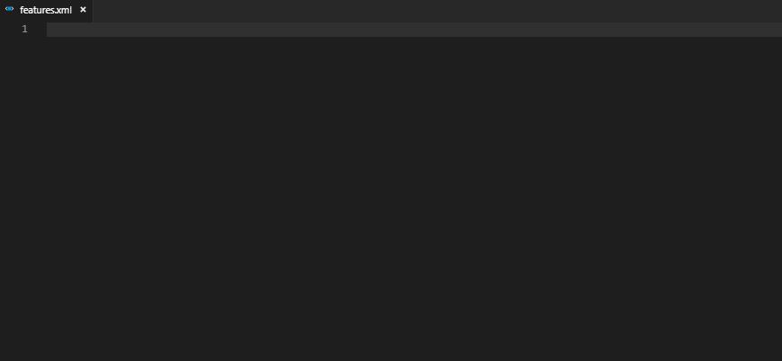

# aurora-snippets

> PREVIEW

Snippets extension for creating xml files for Aurora using Visual Studio Code.

Snippets start with **aurora:** and work in xml files (set xml language mode on index files).

## Features

- populate file with base structure for index or elements file
- todo comment snippet
- basic element snippet
- grant simple skill, weapon, armor, saving throw proficiencies
- grant resistance conditions
- spell snippet

<!-- ## Release Notes

Users appreciate release notes as you update your extension. -->

## [Preview]

initial work in progress release